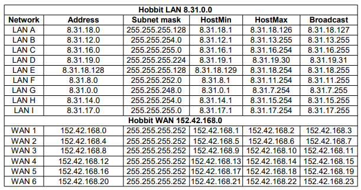

# CCNA in the world of the Lord of the Rings
## Network scheme
Hobbits create computer network in the Shire. Create a table that contains the network address, host ranges, and broadcast address and subnet mask. Create a network diagram with subnetting. The initial LAN is 8.31.0.0/16  and the initial WAN is 152.42.168.0/20.  
  
Required number of devices in networks:  
  
Network diagram with division into subnets:  
  
A developed network 8.31.0.0/16 and 152.42.168.0/12:  
  
## RIP_v2
Make diagrams of the networks below.  
  
After assigning IP addresses to router interfaces and computers, start the RIPv2 protocol.  
  
  
  
  
  
Checking the routing table of router R1.  
  
Test the connection between PC1 and PC2.  
  