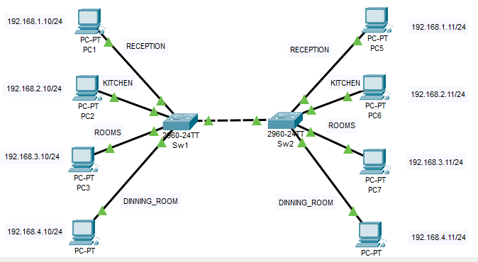
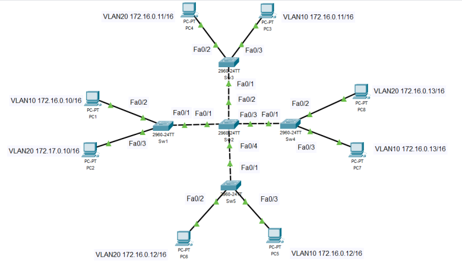
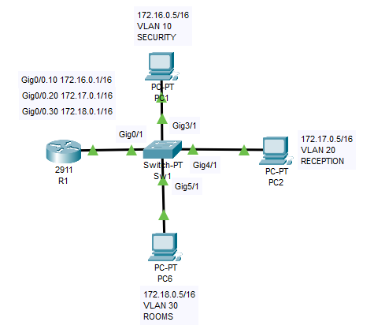
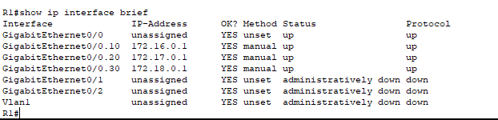

# CCNA in the world of the Lord of the Rings
## Network scheme
Hobbits create computer network in the Shire. Create a table that contains the network address, host ranges, and broadcast address and subnet mask. Create a network diagram with subnetting. The initial LAN is 8.31.0.0/16  and the initial WAN is 152.42.168.0/20.  
  
Required number of devices in networks:  
  
Network diagram with division into subnets:  
  
A developed network 8.31.0.0/16 and 152.42.168.0/12:  
  
## RIP_v2
Make diagram of the networks below.  
  
After assigning IP addresses to router interfaces and computers, start the RIPv2 protocol.  
  
  
  
  
  
Checking the routing table of router R1.  
  
Test the connection between PC1 and PC2.  
  
## VLAN
Make the following network diagram. Assign appropriate IP addresses to workstations.  
  
Create VLANs in switches and assign them appropriate interfaces. Start access mode on interfaces.  
  
Use the show vlan brief command to check if the interfaces are assigned to the indicated VLANs. Then configure the Sw2 switch similarly.  
  
Create a trunk connection between switches.  
  
Test the connection between workstations PC1 and PC5.  
  
## VTP
  
## Inter-VLAN Routing - classic method
In the classic method, the router requires configuration of interfaces, each of which belongs to one VLAN.  
  
Creating VLAN 10, VLAN 20, VLAN 30 and naming them.  
  
Assigning interfaces to VLANs and configuring interfaces to work in access mode.  
  
  
Checking if interfaces are in the correct VLANs.  
  
Assigning IP interests to router interfaces and starting them.  
  
Displaying a list of interfaces on the router.  
  
Checking the connection between workstation PC1 and PC2 and PC3. 
  
## Inter-VLAN Routing - router on a stick
In the router on a stick method, only one wire is used for routing between VLANs in the router.  
  
Using subinterface-based functionality. After creating a subinterface, indicate encapsulation and provide a VLAN id.  
  
Enable the interface.  
  
Displaying a list of interfaces on the router.  
  
After creating VLAN 10, VLAN 20, VLAN 30 on the switch and giving them names, assign interfaces to VLANs and configure the interfaces to work in access mode.  
  
Checking the connection between workstation PC1 and PC2 and PC3.  
  
## Inter-VLAN Routing - L3 switch
Routing between VLANs using a Layer 3 switch performing routing within a single local area network.  
  
Starting routing on the L3 switch. Creating VLAN 10, VLAN 20, VLAN 30. 
Assigning interfaces to VLANs and configuring interfaces to work in access mode. Assigning IP addresses to interfaces and starting them.  
  
Displaying the routing table.  
  
Displaying the routing table.  
  
